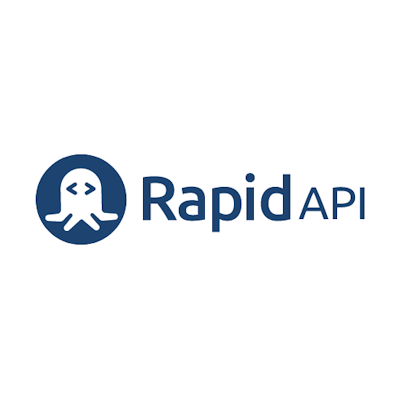

# Week 10 - Claude St-Laurent

# Quality and Test Driven Development

 

* [Link for the TDD Repo](https://github.com/Surveytech/Rocket_Elevators-TDD.git)
* [URL for my site](https://claudestlaurent.xyz)
* [Video link](https://youtu.be/)

## Works done this week
- <ins>Gems added</ins>
- <ins>API's tested</ins>
- <ins>Elements tested in the Rails app</ins>

### 1 - <ins>Gems Added</ins> 

 Here's the list of the gems installed this week to help us with the TDD work

* gem 'rspec-rails'
      https://github.com/rspec/rspec-rails

* gem 'capybara'
      https://github.com/teamcapybara/capybara

* gem 'simplecov'
      https://github.com/simplecov-ruby/simplecov

### 2 - <ins>APIs tested</ins>  

Those are the 2 API in my *streamer.rb* file that I tested with the *streamer_spec.rb*
* [Open Weather Map API from RapidApi](https://rapidapi.com/community/api/open-weather-map/endpoints)

* [Yahoo Finance API from RapidApi](https://rapidapi.com/apidojo/api/yahoo-finance1?endpoint=apiendpoint_33e0cec5-0f8a-4f9f-a6dc-018e6762fbe7)

### 3 - <ins>Rails App elements tested</ins>

Those App elements were also tested 

* New file Streamer.rb with test in Streamer_spec.rb
* intervention_controller.rb with test in intervention_controller_spec.rb
* leads_controller.rb with test in leads_controller_spec.rb
* application_controller.rb with test in the application_controller_spec.rb

<i>Readme created by Claude St-Laurent</i>

